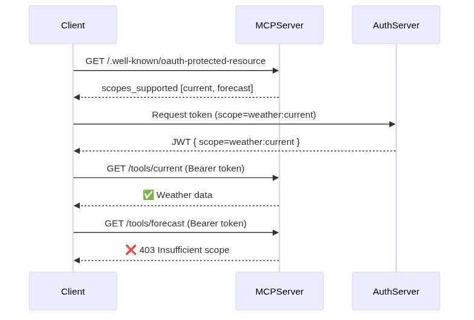

# Module 3.1 — Understanding Scope-Based Access Control for MCP tools

This module introduces a minimal MCP-style resource server implemented in Python using FastAPI.
The goal is to demonstrate scope-based access control (SBAC) and the principle of least privilege in the Model Context Protocol (MCP).

## Building and testing your first MCP tool.

### What this server provides?

#### Metadata endpoint
- /.well-known/oauth-protected-resource
- Advertises supported scopes (weather:current, weather:forecast)- Lists dummy authorization server + JWKS URI
#### Two tools:
- GET /tools/current → returns dummy current weather
    - Requires scope: weather:current

- GET /tools/forecast → returns dummy 3-day forecast
    - Requires scope: weather:forecast

#### Scope enforcement
- JWT tokens validated with a local secret (HS256)
- Requests without the required scope → 403 Forbidden
- Logs record whether access was granted or denied

### Run the server
From project root:
``` bash
uvicorn lls_auth_client.services.mcp_service:app --reload --port 8001
```
Get scoped token for the tool calls

```bash
#  tests/test_mcp.py
import jwt, time
SECRET = "super-secret-key"

# Token for current scope only
token = jwt.encode(
    {"sub": "alice", "scope": "weather:current", "exp": time.time() + 600},
    SECRET,
    algorithm="HS256"
)
print(token)

# Token for current as well as forecast scopes
token = jwt.encode(
    {"sub": "alice", "scope": "weather:current weather:forecast", "exp": time.time() + 600},
    SECRET,
    algorithm="HS256"
)
print(token)
```

### Test with curl

```bash
# Metadata
curl http://localhost:8001/.well-known/oauth-protected-resource | jq

# Current weather (✅ works with Token1 or Token2)
curl -H "Authorization: Bearer <Token1>" http://localhost:8001/tools/current

# Forecast (❌ fails with Token1, ✅ works with Token2)
curl -H "Authorization: Bearer <Token1>" http://localhost:8001/tools/forecast
```

<p align="center">
  
  <br/>
  <em>Figure 1: Scope enforcement in the MCP Weather Tool</em>
</p>


